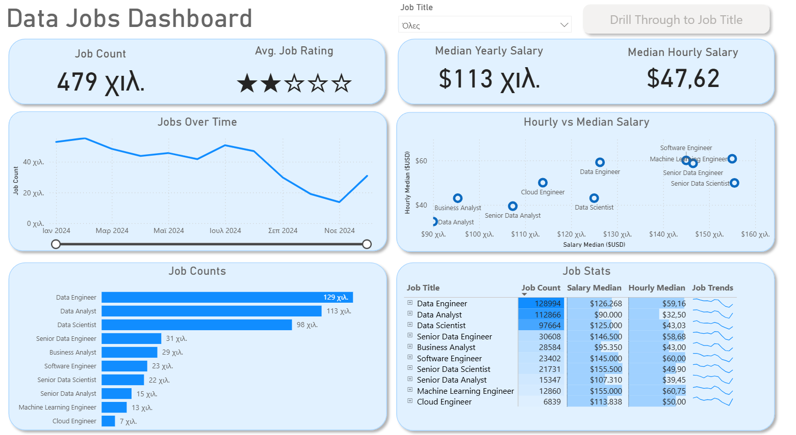

# Data Jobs Dashboard (Power BI)

## About the Project

This is a Power BI portfolio project where I analysed data-related jobs, salaries and job market trends.

The goal of the project was to practice Power BI using a real-world dataset and create an interactive dashboard.

## Tools Used

- Power BI
- Power Query
- DAX

## What I Analysed

- Job count by role
- Median yearly salary
- Median hourly salary
- Average job rating
- Job trends over time
- Salary comparisons across data-related roles

## Dashboard

Interactive Dashboard:

[Power BI Dashboard Link](ΒΑΛΕ_ΕΔΩ_ΤΟ_LINK)](https://app.powerbi.com/view?r=eyJrIjoiZjE0YzBiOTItMzNmNS00MTA4LWI4MjYtMmFhYmM3NTFiOTg5IiwidCI6IjZhMTI1NGYzLWUxNmMtNGU0NS1iOTJjLTgxYTFlNWE5MmIzNCIsImMiOjl9)

## Dashboard Preview

## Learning Note

This dashboard was built by following a step-by-step Power BI tutorial as part of my learning journey and portfolio development.

The project helped me practice dashboard design, data modelling, DAX, Power Query and data visualisation concepts in Power BI

## What I Learned

During this project I practiced data transformation, dashboard design, building visualisations and creating interactive reports using Power BI.

## Author

Vasileios Tatsidis
